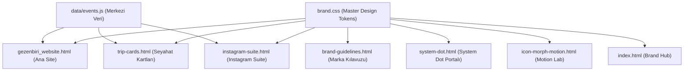

# gezenbiri

> **“Bir yere gidelim.”**  
> Gitmeye değer yerler. Tanışmaya değer insanlar.

`gezenbiri`; insanları yaratıcı atölyeler, yerel sofralar, kültürel buluşmalar ve özenle kürate edilmiş butik geziler & kaçamaklar etrafında bir araya getiren modern bir deneyim ve topluluk markasıdır.

Bu repository; markanın kimlik kılavuzunu, tasarım sistemini (`brand.css`), web sitesi prototipini, sosyal medya şablon paketini (`instagram-suite.html`), çift yüzlü seyahat kartı vitrinini (`trip-cards.html`), merkezi etkinlik veri mimarisini (`data/events.js`) ve otomatik test denetleyicilerini (`full-audit.js`, `qa-check.js`) içeren entegre bir marka ekosistemidir.

---

## 1. Proje Hakkında

gezenbiri, klasik bir turizm acentesi veya standart bir etkinlik takvimi değildir. Markanın temel felsefesi; **mekânın kendisinden çok, o mekânda birlikte yaşanan samimi deneyim ve kurulan sosyal bağın değerli olduğu** fikrine dayanır.

* **Resmi Alan Adları:** `gezenbiri.com.tr` · `gezenbiri.co`
* **İletişim:** `selam@gezenbiri.com.tr`
* **Resmi Sosyal Kanal:** [@gezenbiri (Instagram)](https://instagram.com/gezenbiri)
* **Yayın Modeli:** Tamamen statik HTML5, saf Vanilla CSS (`brand.css`) ve hafif Vanilla JavaScript. Dış derleyici, bundler veya runtime bağımlılığı gerektirmez; GitHub Pages ve tüm statik CDN platformlarıyla %100 uyumludur.

---

## 2. Marka Özeti

* **Ana Slogan:** `Bir yere gidelim.` *(Cümle sonundaki nokta tipografiktir; turuncu System Dot'a dönüştürülmez).*
* **İkincil Marka Cümlesi:** `Gitmeye değer yerler. Tanışmaya değer insanlar.`
* **Manifesto Kapanışı:** `Arada bir gitmek lazım. Biz de sadece gezenbiriyiz.`
* **5 Marka Karakteri:**
  1. **Spontane:** Katı planlar yerine akışa ve anın sürprizlerine açık.
  2. **Sıcak & Samimi:** Mesafeli kurumsal dil yerine birinci tekil/çoğul davetkar ton.
  3. **Meraklı:** Popüler turistik noktalar yerine yerel hikâyeleri ve arka sokakları arayan.
  4. **Sade & Minimal:** Gösterişten uzak, tipografi ve boşluklarla nefes alan editoryal duruş.
  5. **Sosyal:** Tek başına katılan birinin bile ilk 10 dakikada ait hissettiği topluluk kültürü.

---

## 3. Marka Varlıkları

### Wordmark (Logo)
* **Kural:** Her zaman küçük harf (`lowercase`) ve birleşik yazılır: `gezenbiri`.
* **Tipografi:** Plus Jakarta Sans 900 (Black).
* **Bileşen:** `gezenbiri<span class="brand-system-dot"></span>`
* **Yasaklar:** `GEZENBİRİ` (tümü büyük harf), `Gezen Biri` (ayrık iki kelime) veya `Gezenbiri` (baş harfi büyük) kullanımı marka kurallarına aykırıdır.

### Resmi Monogram
* **Kural:** Küçük harf `gb` ve bitişiğinde System Dot:
  `gb<span class="brand-system-dot"></span>`
* **Kullanım:** Favicon, mobil uygulama ikonu, mühür damgaları ve sosyal medya profil avatarlarında tercih edilir.

### Alt Seri / Kategori İsimlendirmesi
Tüm alt deneyim kolları tek tip, küçük harf ve boşluklu formülle adlandırılır:
* `gezenbiri atölye` — Seramik, koku, linol, gastronomi atölyeleri.
* `gezenbiri sofra` — Bağ evlerinde ve yerel restoranlarda uzun masa buluşmaları.
* `gezenbiri hafta sonu` — 1-2 günlük yakın rota kaçamakları.
* `gezenbiri rota` — Alaçatı, Kapadokya, Bozcaada, Urla butik seyahatleri.
* `gezenbiri yerel` — Yerel üreticilerle zeytin hasadı, bağ bozumu, peynir tadımı.
* `gezenbiri sürpriz` — Rotası son ana kadar gizli tutulan spontane yolculuklar.
* `gezenbiri buluşma` — Şehir içi kahve, sergi ve yürüyüş toplanmaları.
* `gezenbiri gece` — Açık hava sineması, kamp ateşi ve gece sohbetleri.

---

## 4. System Dot Mimarisi

System Dot, logodaki sıradan bir nokta işareti değildir; **aksiyonun, tamamlanmanın ve yola çıkış planının sembolüdür.**

```
       ┌─────────── width: 0.15em
       │  ┌──────── height: 0.15em
       │  │  ┌───── transform: scaleY(1.03)  (%103 Optik Dikey Esneme)
       ▼  ▼  ▼
  gezenbiri●
           ▲
           └─────── margin-left: 0.12em  (Master Boşluk)
```

### Teknik Parametreler
* **Genişlik (`width`):** `0.15em`
* **Yükseklik (`height`):** `0.15em`
* **Harf Boşluğu (`margin-left`):** `0.12em`
* **Optik Form (`transform`):** `scaleY(1.03)` *(Dairenin mükemmel Plus Jakarta Sans x-height dengesine oturması için dikeyde %3 esnetilmiş özel elips).*
* **Köşe Ovalliği (`border-radius`):** `50%`
* **Renk:** `var(--gb-coral)` (`#FF4D3D`)

### Statik vs. Live Dot Ayrımı
1. **Statik Logo Dot (`.brand-system-dot` / `.system-dot`):** Logoda ve monogramda yer alan nokta kesinlikle **statiktir**, animasyon içermez.
2. **Live State Indicator (`.gb-live-dot` / `.live-badge-dot`):** Kontenjan durumu, canlı yayın, aktif rota veya geri sayım göstergelerinde kullanılan noktadır; CSS pulse animasyonuyla yanıp söner.

### Action Coral ile System Dot Arasındaki Fark
* **Action Coral (`#FF4D3D`):** Tasarım sisteminin birincil aksiyon rengidir; butonlar, bağlantılar ve önemli vurgular bu rengi kullanır.
* **System Dot:** Bir UI rengi değil, markanın geometrik kimlik bileşenidir. Boyutu ve konumu doğrudan bağlı olduğu fontun `em` değerinden türetilir.

---

## 5. Tasarım Sistemi (Design Tokens)

Tasarım sistemi kuralları [`brand.css`](file:///c:/Users/Mahir/Desktop/gezenbiri/brand.css) dosyasında merkezi CSS değişkenleri olarak tanımlanmıştır:

### Renk Paleti (65-20-10-5 Kuralı)

| Ton Adı | Token | HEX Değeri | Rolü & Oranı |
| :--- | :--- | :--- | :--- |
| **Warm Cream** | `--gb-cream` | `#F6F3ED` | Tuval & Arka Plan (%65) |
| **Deep Charcoal** | `--gb-charcoal` | `#202020` | Tipografi & Kontrast (%20) |
| **Action Coral** | `--gb-coral` | `#FF4D3D` | Aksiyon, Butonlar, System Dot (%10) |
| **Sage Green** | `--gb-sage` | `#A8B89A` | Doğa, Dinlenme, Vurgu Rozetleri (%5) |
| **Sky Blue** | `--gb-sky` | `#A9D5E8` | Deniz & Kıyı Rotaları (Destekleyici) |
| **Sand** | `--gb-sand` | `#D8CCBC` | Toprak, Taş Doku, Kart Arka Planı |
| **Stone** | `--gb-stone` | `#D9D6D1` | Nötr Ayırıcılar & Çizgiler |
| **Pure White** | `--gb-white` | `#FFFFFF` | Kart Gövdeleri & Temiz Katmanlar |

### Tipografi Skalası

* **Birincil UI Ailesi:** `Plus Jakarta Sans` (Google Fonts)
  * `900 (Black)`: Logo ve Monogram
  * `800 (ExtraBold)`: Hero Başlıkları ve Öne Çıkan Display Metinler
  * `700 (Bold)`: Bölüm Başlıkları (H1, H2, H3) ve Butonlar
  * `500 / 600`: Kart Başlıkları ve Meta Bilgiler
  * `400 (Regular)`: Gövde Metinleri (Body Copy)
* **Editoryal Vurgu Ailesi:** `Instrument Serif (Italic)`
  * Manifesto cümleleri, editoryal alıntılar ve rota atmosfer kartlarında kullanılır.
  * Buton, menü, form ve genel UI bileşenlerinde **kesinlikle kullanılmaz.**

### Sınır Ovallikleri (Border Radius) & Gölgeler
* `--gb-radius-sm`: `8px` *(Butonlar, küçük etiketler)*
* `--gb-radius-md`: `12px` *(Giriş kutuları, açılır pencereler)*
* `--gb-radius-lg`: `20px` *(Seyahat ve atölye kartları)*
* `--gb-radius-pill`: `100px` *(Hap butonlar, filtreler, navigasyon sekmeleri)*
* `--gb-shadow-subtle`: `0 4px 20px rgba(0, 0, 0, 0.04)`
* `--gb-shadow-floating`: `0 16px 40px rgba(0, 0, 0, 0.12)`

---

## 6. Repository Dosya Ağacı

```text
msaglamoz/gezenbiri/
├── index.html                   # Brand System Hub (Ana kontrol paneli & portal)
├── gezenbiri_website.html       # Resmi Canlı Web Sitesi (3'lü kolajlı Master vitrin)
├── brand-guidelines.html        # 15 Modüllük Kapsamlı Marka Kılavuzu & Standartlar
├── system-dot.html              # System Dot Standartları, ZIP İndirme & Logo Vitrini
├── icon-morph-motion.html        # Adaptif Morphing İkon & Kanca (Hook) Motion Laboratuvarı
├── trip-cards.html              # Çift Yüzlü Editoryal Seyahat Kartları Vitrini
├── instagram-suite.html         # Instagram Story (9:16) & Feed (1:1) Master Şablon Paketi
├── brand.css                    # Tek Doğruluk Kaynağı: Master Design Tokens & CSS
├── data/
│   └── events.js                # Merkezi Etkinlik & Rota Verisi (Single Source of Truth)
├── assets/                      # Üretim görselleri (alacati, kapadokya, v2 atölyeler)
├── archive/                     # Eski versiyon arşivi (gezenbiri_website_v2.html)
├── örnekler/                    # Referans taslaklar ve konsept çalışmaları
├── full-audit.js                # 25 Testlik Kapsamlı DOM & Marka Denetleyicisi
├── qa-check.js                  # 11 Testlik Hızlı Regresyon & Bütünlük Kontrolü
├── package.json                 # Test ve otomasyon scriptleri
└── README.md                    # Bu dokümantasyon
```

---

## 7. Teknik Mimari

Proje, herhangi bir framework (React, Vue, Next.js vb.) veya derleme adımına ihtiyaç duymayan **Modern Pure Web (HTML5 + CSS Tokens + ES6 Vanilla JS)** mimarisiyle inşa edilmiştir.



* **Master CSS:** [`brand.css`](file:///c:/Users/Mahir/Desktop/gezenbiri/brand.css) tüm sayfaların tasarım tokenlarını, System Dot geometrisini ve tipografi kurallarını tek bir kaynaktan yönetir.
* **Merkezi Veri:** [`data/events.js`](file:///c:/Users/Mahir/Desktop/gezenbiri/data/events.js) tüm deneyim ve rotaların fiyat, tarih, lokasyon ve kontenjan bilgilerini tek bir kaynaktan sunar.

---

## 8. Merkezi Etkinlik Verisi (`data/events.js`)

Merkezi veri dosyası, sayfalardaki hardcoded içerikleri ortadan kaldırarak verilerin tek bir yerden dinamik olarak yönetilmesini sağlar (`Single Source of Truth`).

### Veri Modeli Yapısı
```javascript
{
    id: 'ws-seramik',
    category: 'Workshop',
    title: 'Çömlek Tornası & Seramik Atölyesi',
    location: 'Alaçatı',
    price: '₺1.450',
    startDate: '2026-08-26',
    endDate: '2026-08-26',
    startMeta: { day: '26', month: 'Ağustos', dayName: 'Çarşamba' },
    endMeta: { day: '26', month: 'Ağustos', dayName: 'Çarşamba' },
    description: 'Toprağa dokunmak, çömlek tornasında kendi fincanını üretmek...',
    included: ['Tüm Malzemeler', 'Pişirim', 'Kahve & İkramlar', 'Eğitmen'],
    isPrototype: true
}
```

### Yardımcı Fonksiyonlar (API)
* `GezenbiriData.events`: Tüm etkinliklerin tam listesi.
* `GezenbiriData.getWorkshops()`: Sadece atölye ve workshop kayıtlarını döndürür.
* `GezenbiriData.getTrips()`: Sadece seyahat ve rota kayıtlarını döndürür.
* `GezenbiriData.getById(id)`: Belirtilen `id` değerine sahip etkinliği getirir.
* `GezenbiriData.formatDateTurkish(start, end)`: Tarih aralıklarını `"24 - 25 Ağustos 2026"` veya tekil `"26 Ağustos 2026"` formatına çevirir.

### Dinamik Hydration Entegrasyonu
1. **Web Sitesi (`gezenbiri_website.html`):** `renderAllEventsFromData()` fonksiyonu ile atölye gridini ve gezi carousel'ini oluşturur.
2. **Seyahat Kartları (`trip-cards.html`):** `hydrateTripCardsFromData()` fonksiyonu ile 8 adet poster kartının tarih, gün ismi, fiyat ve WhatsApp rezervasyon linklerini dinamik senkronize eder.
3. **Instagram Paketi (`instagram-suite.html`):** `hydrateInstagramSuiteFromData()` fonksiyonu ile story ve feed şablonlarındaki gün adlarını (`startMeta.dayName`) ve fiyatları doldurur.

---

## 9. Uygulama Sayfaları

1. **Brand System Hub ([`index.html`](file:///c:/Users/Mahir/Desktop/gezenbiri/index.html)):** Tüm marka bileşenlerine, canlı sayfalara, resmi alan adı varlıklarına ve kılavuzlara tek noktadan erişim sunan ana karşılama portalı.
2. **Resmi Web Sitesi ([`gezenbiri_website.html`](file:///c:/Users/Mahir/Desktop/gezenbiri/gezenbiri_website.html)):** 3'lü editoryal hero kolajı, tematik kategori kartları, dinamik workshop & rota akışı, topluluk yorumları ve WCAG erişilebilir modallarla donatılmış ana web deneyimi.
3. **Marka Kılavuzu ([`brand-guidelines.html`](file:///c:/Users/Mahir/Desktop/gezenbiri/brand-guidelines.html)):** Felsefeden renge, tipografiden ses tonuna ve geliştirici tokenlarına kadar 15 modülden oluşan kapsamlı marka rehberi posteri.
4. **System Dot Portalı ([`system-dot.html`](file:///c:/Users/Mahir/Desktop/gezenbiri/system-dot.html)):** System Dot geometrisinin detayları, 6 farklı kurumsal renk varyasyonunun canlı sunumu ve tek tıkla tüm marka varlıklarını PNG/ZIP olarak indirme aracı.
5. **Seyahat Kartları Vitrini ([`trip-cards.html`](file:///c:/Users/Mahir/Desktop/gezenbiri/trip-cards.html)):** Çift yüzlü editoryal rota kartları (ön yüz poster, arka yüz lojistik & dahil olanlar kartı), kategori filtreleri ve entegre rezervasyon modali.
6. **Instagram Master Suite ([`instagram-suite.html`](file:///c:/Users/Mahir/Desktop/gezenbiri/instagram-suite.html)):** 6 adet 9:16 Story, 8 adet 1:1 Feed şablonu, etkileşimli avatar özelleştirici ve panoya tek tıkla kopyalama motoru.

---

## 10. Kalite Güvence & Otomatik Denetim (QA & Audit)

Sistemin tutarlılığını ve tasarım kurallarını korumak için 2 farklı seviyede otomatik test scripti bulunmaktadır:

### 1. `qa-check.js` (Hızlı Regresyon Kontrolü)
11 kritik kontrolü çalıştırır:
* Eski 0-1px System Dot kalıntılarının yokluğu
* 0.155em double-stretch hatasının engellenmesi
* Kırık `01_`, `02_`, `03_`, `04_` dosya yollarının denetimi
* `#F7F5F0` veya `#EAE5DC` renk kaymalarının tespiti
* `data/events.js` dosyasının mevcudiyeti ve veri bütünlüğü
* Vektörel elips favicon doğrulaması
* `brand.css` tek doğruluk kaynağı bağlantısı
* Modal keyboard focus trap ve WCAG standartları

### 2. `full-audit.js` (25 Testlik Derin DOM & Tasarım Sistemi Denetleyicisi)
Kapsamlı marka uygunluğunu ve DOM ağacını denetler:
* **DOM Semantiği:** System Dot'un `<span>` olarak kullanılması, blok `<div>` veya `.logotext` wrapper'larının engellenmesi.
* **Inline CSS Yasağı:** System Dot üzerinde `width` veya `height` gibi inline override'ların bulunmaması.
* **Ses Tonu:** *"Unutulmaz tatil"*, *"erken rezervasyon"* gibi klişe acente tabirlerinin taranması.
* **Varlık Bütünlüğü:** `src="..."` veya CSS `url(...)` ile çağrılan tüm görsellerin diskte fiziksel olarak mevcut olduğunun (sıfır 404) doğrulanması.

### Testleri Çalıştırma
```bash
# Tüm test paketini tek seferde çalıştırmak için:
npm test

# Sadece derin DOM ve marka denetimi için:
node full-audit.js

# Sadece hızlı regresyon kontrolü için:
node qa-check.js
```
*(Not: Node.js yalnızca bu test scriptlerini çalıştırmak için gereklidir; web sayfalarını görüntülemek için herhangi bir bağımlılık gerekmez).*

---

## 11. Yerel Geliştirme (Local Development)

Proje tamamen statik olduğu için çalıştırması son derece kolaydır:

1. **Repoyu Klonlayın:**
   ```bash
   git clone https://github.com/msaglamoz/gezenbiri.git
   cd gezenbiri
   ```
2. **Doğrudan Tarayıcıda Açın:**
   * [`index.html`](file:///c:/Users/Mahir/Desktop/gezenbiri/index.html) dosyasını herhangi bir modern web tarayıcısında (Chrome, Safari, Edge, Firefox) çift tıklayarak açabilirsiniz.
3. **Veya Yerel Statik Sunucu ile Başlatın:**
   * VS Code *Live Server* eklentisi ile `index.html` üzerinde sağ tıklayıp *Open with Live Server* seçebilirsiniz.
   * Veya Python ile: `python -m http.server 8000`
   * Veya Node.js ile: `npx serve .`

---

## 12. Katkı ve Geliştirme Kuralları (Contribution Rules)

Sisteme yeni bir sayfa, bileşen veya rota eklerken aşağıdaki kurallara kesinlikle uyulmalıdır:

1. **Marka Renklerini Değiştirmeyin:** `#F6F3ED`, `#202020`, `#FF4D3D` ve `#A8B89A` master değerlerdir; rastgele tonlar veya keyfi hex kodları eklenemez.
2. **System Dot Geometrisini Ezmeyin:** System Dot geometrisi (`0.15em`, `0.12em`, `scaleY(1.03)`) yalnızca [`brand.css`](file:///c:/Users/Mahir/Desktop/gezenbiri/brand.css) içinde tanımlıdır. Sayfa içi `<style>` bloğunda veya `style="..."` attribute'ünde yeniden tanımlanamaz.
3. **Etkinlik Verisini Duplicate Etmeyin:** Yeni bir workshop veya rota ekleneceğinde, doğrudan [`data/events.js`](file:///c:/Users/Mahir/Desktop/gezenbiri/data/events.js) dosyasına eklenmeli ve sayfalar bu veriyi JS ile render etmelidir.
4. **Marka İsmini Küçük Harf Tutun:** `gezenbiri` her zaman tek kelime ve küçük harftir.
5. **Emojileri Kesinlikle Kullanmayın:** `🎈`, `🍷`, `🧡`, `🏺`, `🌸` benzeri native/dekoratif emojiler sistemin hiçbir yerinde kullanılmaz; ikonografi için yalnızca markanın kendi monoline SVG glifleri ve temiz tipografi kullanılır.
6. **Erişilebilirlik Standartlarını Koruyun:** Açılan tüm modallarda `role="dialog"`, `aria-modal="true"`, `Tab`/`Shift+Tab` odak tuzağı ve `ESC` tuşu dinleyicisi korunmalıdır.
7. **Değişiklik Sonrası Testleri Çalıştırın:** Her commit öncesinde terminalde `npm test` komutu çalıştırılarak tüm testlerin yeşil (`PASS`) olduğu teyit edilmelidir.

---

## 13. Arşiv & Geçmiş Versiyonlar (`/archive`)

Projenin tasarım evrimi ve önceki alternatif konseptleri `/archive` dizininde saklanmaktadır:
* [`archive/gezenbiri_website_v2.html`](file:///c:/Users/Mahir/Desktop/gezenbiri/archive/gezenbiri_website_v2.html) — Önceki V2 web sitesi düzeni.
* [`archive/gezenbiri_website_v1.html`](file:///c:/Users/Mahir/Desktop/gezenbiri/archive/gezenbiri_website_v1.html) — İlk aşama ham prototip arşivi.

---

## 14. Lisans ve Kullanım Notu

Bu repository içindeki tüm görsel, tipografik ve metinsel marka varlıkları **gezenbiri** topluluk projesine aittir.

* © 2026 **gezenbiri** (`gezenbiri.com.tr` · `gezenbiri.co`). Tüm hakları saklıdır.
