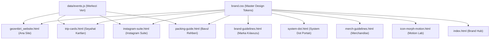

# gezenbiri

> **“Bir yere gidelim.”**  
> Gitmeye değer yerler. Tanışmaya değer insanlar.  
> 
> **Tasarım & Marka Yaratıcısı:** [**Mahir Sağlamöz**](https://github.com/msaglamoz) ([@msaglamoz](https://github.com/msaglamoz))

`gezenbiri`; insanları yaratıcı atölyeler, yerel sofralar, kültürel buluşmalar ve özenle kürate edilmiş butik geziler & kaçamaklar etrafında bir araya getiren modern bir deneyim ve topluluk markasıdır.

Bu repository; markanın kimlik kılavuzunu (`brand-guidelines.html`), tasarım sistemini (`brand.css`), web sitesi portalını (`gezenbiri_website.html`), sosyal medya şablon paketini (`instagram-suite.html`), çift yüzlü seyahat kartı vitrinini (`trip-cards.html`), adaptif morphing ikon laboratuvarını (`icon-morph-motion.html`), gezgin bavul & hazırlık rehberini (`packing-guide.html`), fiziksel ürün ve stüdyo çekimi kitini (`merch-guidelines.html`), merkezi etkinlik veri mimarisini (`data/events.js`) ve 25 testlik otomatik marka denetleyicisini (`full-audit.js`) içeren entegre bir marka ekosistemidir.

---

## 1. Proje Hakkında & Dijital Varlıklar

gezenbiri, klasik bir turizm acentesi veya standart bir etkinlik takvimi değildir. Markanın temel felsefesi; **mekânın kendisinden çok, o mekânda birlikte yaşanan samimi deneyim ve kurulan sosyal bağın değerli olduğu** fikrine dayanır.

### 4 Kanallı Resmi Dijital Ekosistem:
* **Birincil Web Portalı:** [`gezenbiri.com.tr`](https://gezenbiri.com.tr) — Atölye kayıtları, deneyim ve rota portalı.
* **Yeni Nesil .TR Alan Adı:** [`gezenbiri.tr`](https://gezenbiri.tr) — Doğrudan ve yalın ulusal erişim kapısı.
* **Kısa Link & Yönlendirme:** [`gezenbiri.co`](https://gezenbiri.co) — Sosyal bio bağlantıları ve QR yönlendirmeleri.
* **Resmi Sosyal Kanal:** [`@gezenbiri` (Instagram)](https://instagram.com/gezenbiri) — Topluluk anları ve hikaye yayınları.
* **İletişim:** `selam@gezenbiri.com.tr`
* **Yayın Mimarisi:** Tamamen statik HTML5, saf Vanilla CSS (`brand.css`) ve hafif Vanilla JavaScript. Dış derleyici veya runtime bağımlılığı gerektirmez; GitHub Pages ve CDN platformlarıyla %100 uyumludur.

---

## 2. Marka Özeti & Felsefe

* **Ana Slogan:** `Bir yere gidelim.` *(Cümle sonundaki nokta tipografiktir; turuncu System Dot'a dönüştürülmez).*
* **İkincil Marka Cümlesi:** `Gitmeye değer yerler. Tanışmaya değer insanlar.`
* **Manifesto Kapanışı:** `Arada bir gitmek lazım. Biz de sadece gezenbiriyiz.`
* **5 Marka Karakteri:**
  1. **Spontane:** Katı planlar yerine akışa ve anın sürprizlerine açık.
  2. **Sıcak & Samimi:** Mesafeli kurumsal dil yerine birinci tekil/çoğul davetkar ton.
  3. **Meraklı:** Popüler turistik noktalar yerine yerel hikâyeleri ve arka sokakları arayan.
  4. **Sade & Minimal:** Gösterişten uzak, tipografi ve boşluklarla nefes alan editoryal duruş.
  5. **Sosyal:** Tek başına katılan birinin bile ilk 10 dakikada ait hissettiği topluluk kültürü.

---

## 3. Marka Varlıkları & Tipografik Anatomi

### Wordmark (Logo)
* **Kural:** Her zaman küçük harf (`lowercase`) ve tek kelime yazılır: `gezenbiri`.
* **Tipografi:** Plus Jakarta Sans 900 (Black).
* **Bileşen:** `gezenbiri<span class="system-dot"></span>`
* **Yasaklar:** `GEZENBİRİ` (tümü büyük harf), `Gezen Biri` (ayrık iki kelime) veya `Gezenbiri` (baş harfi büyük) kullanımı marka kurallarına aykırıdır.

### Resmi Monogram
* **Kural:** Küçük harf `gb` ve bitişiğinde System Dot: `gb<span class="system-dot"></span>`
* **Kullanım:** Favicon, mobil uygulama ikonu, mühür damgaları ve sosyal medya profil avatarlarında tercih edilir.

### Tipografik Anatomi Çözümlemesi
```
   gezen                biri                ● (System Dot)
┌──────────────┐     ┌──────────────┐     ┌────────────────────────────────┐
│ Eylem & Hareket│     │ Özne & İnsan │     │ O İnsanın Ayak İzi & Varlığı   │
│ Keşif & Rota  │     │ Sen, Biz, O  │     │ Aksiyon ve Karar Mührü         │
└──────────────┘     └──────────────┘     └────────────────────────────────┘
```

### Alt Seri / Kategori İsimlendirmesi
Tüm alt deneyim kolları tek tip, küçük harf ve boşluklu formülle adlandırılır:
* `gezenbiri atölye` — Seramik, koku, linol, gastronomi atölyeleri.
* `gezenbiri sofra` — Bağ evlerinde ve yerel restoranlarda uzun masa buluşmaları.
* `gezenbiri hafta sonu` — 1-2 günlük yakın rota kaçamakları.
* `gezenbiri rota` — Alaçatı, Kapadokya, Bozcaada, Urla butik seyahatleri.
* `gezenbiri yerel` — Yerel üreticilerle zeytin hasadı, bağ bozumu, peynir tadımı.
* `gezenbiri sürpriz` — Rotası son ana kadar gizli tutulan spontane yolculuklar.
* `gezenbiri buluşma` — Şehir içi kahve, sergi ve yürüyüş toplanmaları.
* `gezenbiri gece` — Açık hava sineması, kamp ateşi ve gece sohbetleri.

---

## 4. System Dot Mimarisi & Dörtlü Anlam Katmanı

System Dot, logodaki sıradan bir nokta işareti değildir; **“Logodaki nokta salt bir grafik değil; gitmeye karar veren o ‘biri’dir.”**

```
       ┌─────────── width: 0.15em
       │  ┌──────── height: 0.15em
       │  │  ┌───── transform: scaleY(1.03)  (%103 Optik Dikey Esneme)
       ▼  ▼  ▼
  gezenbiri●
           ▲
           └─────── margin-left: 0.12em  (Master Boşluk ~2.5px Optik Kilit)
```

### Dörtlü Anlam Sütunu (4 Master Pillars):
1. **1. Aksiyon Kıvılcımı (CTA & Eylem):** *"Bir yere gidelim."* çağrısının kıvılcımı. Düşünceden eyleme geçişi ateşleyen dinamik itici güç (`Keşfet •`).
2. **2. Hedef Koordinat (Harita & Durak):** Haritada işaretlenen o özel nokta. Varılan koy, toplanılan seramik atölyesi, kadehin kalktığı bağ sofrası (`📍 [•] Varış`).
3. **3. Karar Mührü (Netlik & Son Nokta):** Kararsızlığı ve bahaneleri bitiren son nokta. *"Cuma çıkıyoruz, pazar dönüyoruz."* netliği (`Alaçatı.`).
4. **4. Özne & İnsan ("biri"):** Yola çıkan o 1 gezgin, masadaki o 1 insan. Kitleler içinde kaybolmayan, aramızdan biri; bizzat sen (`biri •`).

### Teknik Parametreler
* **Genişlik (`width`):** `0.15em`
* **Yükseklik (`height`):** `0.15em`
* **Harf Boşluğu (`margin-left`):** `0.12em` (~2.5px)
* **Optik Form (`transform`):** `scaleY(1.03)` *(Dikeyde %3 esnetilmiş özel elips).*
* **Köşe Ovalliği (`border-radius`):** `50%`
* **Renk:** `var(--gb-coral)` (`#FF4D3D`)

### Statik vs. Live Dot Ayrımı
1. **Statik Logo Dot (`.system-dot` / `.gb-system-dot`):** Logoda ve monogramda yer alan nokta kesinlikle **statiktir**, animasyon içermez.
2. **Live State Indicator (`.gb-live-dot` / `.live-badge-dot`):** Kontenjan durumu, canlı yayın, aktif rota veya geri sayım göstergelerinde kullanılan noktadır; CSS pulse animasyonuyla (`prestigeHeroPulse`) yanıp söner.

---

## 5. Tasarım Sistemi (Design Tokens)

Tasarım sistemi kuralları [`brand.css`](file:///c:/Users/Mahir/Desktop/gezenbiri/brand.css) dosyasında merkezi CSS değişkenleri olarak tanımlanmıştır:

### Çift Dilli Renk Paleti (65-20-10-5 Kuralı & 7 Ton)

| Resmi Token Adı | Türkçe Karşılığı | Token | HEX Değeri | Rolü & Oranı |
| :--- | :--- | :--- | :--- | :--- |
| **Warm Cream** | **Sıcak Krem** | `--gb-cream` | `#F6F3ED` | Tuval & Arka Plan (%65) |
| **Dark Charcoal** | **Koyu Kömür** | `--gb-charcoal` | `#202020` | Tipografi & Kontrast (%20) |
| **Action Coral** | **Aksiyon Mercanı** | `--gb-coral` | `#FF4D3D` | Aksiyon, Butonlar, System Dot (%10) |
| **Sage Green** | **Adaçayı Yeşili** | `--gb-sage` | `#A8B89A` | Doğa, Dinlenme, Vurgu Rozetleri (%5) |
| **Sky Blue** | **Gökyüzü Mavisi** | `--gb-sky` | `#A9D5E8` | Deniz & Kıyı Rotaları (Destekleyici) |
| **Sand Beige** | **Kum Beji** | `--gb-sand` | `#D8CCBC` | Toprak, Sıcak Doku, Kart Arka Planı |
| **Stone Grey** | **Taş Grisi** | `--gb-stone` | `#D9D6D1` | Nötr Ayırıcılar & Çizgiler |
| **Pure White** | **Saf Beyaz** | `--gb-white` | `#FFFFFF` | Kart Gövdeleri & Temiz Katmanlar |

### Tipografi Skalası
* **Birincil UI Ailesi:** `Plus Jakarta Sans` (Google Fonts)
  * `900 (Black)`: Logo ve Monogram
  * `800 (ExtraBold)`: Hero Başlıkları ve Öne Çıkan Display Metinler
  * `700 (Bold)`: Bölüm Başlıkları (H1, H2, H3) ve Butonlar
  * `500 / 600`: Kart Başlıkları ve Meta Bilgiler
  * `400 (Regular)`: Gövde Metinleri (Body Copy)
* **Editoryal Vurgu Ailesi:** `Instrument Serif (Italic)`
  * Manifesto cümleleri, editoryal alıntılar ve rota atmosfer kartlarında kullanılır.
  * Buton, menü, form ve genel UI bileşenlerinde **kesinlikle kullanılmaz.**

### Sınır Ovallikleri (Border Radius) & Gölgeler
* `--gb-radius-sm`: `8px` *(Butonlar, küçük etiketler)*
* `--gb-radius-md`: `12px` *(Giriş kutuları, açılır pencereler)*
* `--gb-radius-lg`: `20px` *(Seyahat ve atölye kartları)*
* `--gb-radius-pill`: `100px` *(Hap butonlar, filtreler, navigasyon sekmeleri)*
* `--gb-shadow-subtle`: `0 4px 20px rgba(0, 0, 0, 0.04)`
* `--gb-shadow-floating`: `0 16px 40px rgba(0, 0, 0, 0.12)`

---

## 6. Fiziksel Ürün Kimliği & Merchandise Standartları (`merch-guidelines.html`)

Markanın fiziksel dünyadaki dokunsal varlığı için 6 çekirdek ürün tanımlanmış ve yüksek çözünürlüklü stüdyo fotoğrafçılığı ile görselleştirilmiştir:

```
                      ┌────────────────────────────────────────┐
                      │    MERCHANDISE ÜRÜN EKOSİSTEMİ         │
                      └──────────────────┬─────────────────────┘
                                         │
        ┌──────────────┬─────────────────┼─────────────────┬──────────────┐
        ▼              ▼                 ▼                 ▼              ▼
   01. HAM BEZ   02. EMAYE KUPA    03. KANVAS ŞAPKA   04. NOT DEFTERİ   05. DERİ ETİKET
  320gr Ham Pamuk  Çelik Emaye       Yıkanmış Pamuk    Kraft Kapak Cilt   Hakiki Deri
  Krem + Mercan   Krem + Siyah Ağız Kömür + Mikro Dot  Çizgisiz Fildişi   Gömme Sıcak Baskı
```

### Ürün Listesi ve Teknik Özellikleri:
1. **Ham Bez Çanta (Tote Bag):** 320 gr/m² %100 organik ham pamuk kanvas, 38×42 cm, Action Coral System Dot serigrafi baskı.
2. **Emaye Kamp Kupası:** 350 ml paslanmaz çelik gövde üzeri fırınlanmış Warm Cream emaye kaplama, siyah damlatmaz ağız çemberi.
3. **Yıkanmış Kanvas Şapka (Cap):** 6 panelli eskitme taşlanmış pamuklu kanvas (Dark Charcoal), arkada pirinç toka, ön panelde mikro nakış logo.
4. **Seyahat Not Defteri:** 13×21 cm sert kapak, iplik dikişli fildişi sayfalar, Action Coral elastik tutucu bant ve kumaş ayraç.
5. **Deri Bagaj Etiketi:** 2.5 mm hakiki vejetal deri, pirinç tokalı ayarlanabilir kayış, gömme sıcak gofre baskı logo.
6. **Mat Vinil Mühür Paketi:** 90 mikron ekstra dayanıklı dış mekan vinil çıkartmalar (Suya ve UV ışınlarına %100 dayanıklı).

### Pantone & Serigrafi Üretim Matrisi:
* **Action Coral:** `PANTONE 1788 C` · CMYK: `0 / 84 / 77 / 0` · Serigrafi & Tekstil
* **Dark Charcoal:** `PANTONE Black 6 C` · CMYK: `70 / 65 / 60 / 75` · Metal & Kumaş
* **Warm Cream:** `PANTONE 7527 C` · CMYK: `4 / 5 / 10 / 0` · Doku & Porselen
* **Sage Green:** `PANTONE 5645 C` · CMYK: `35 / 15 / 30 / 10` · Rozet & Detay

---

## 7. Adaptif Morphing İkon Sistemi & Motion Lab (`icon-morph-motion.html`)

gezenbiri piktogram sisteminde System Dot, dekoratif bir dolgu değil; her glifin taşıdığı anlamın **“geometrik çekirdeği” (nucleus)** ve eylem odağıdır.

### 8 Özel Monoline Glif:
1. **01. Konum & Rota (Pin):** Harita pininin kalbindeki hedef koordinat noktası.
2. **02. Takvim & Tarih:** Ayın 16'sını ve rezervasyon gününü kilitleyen aksiyon noktası.
3. **03. Kahve & Fincan:** Dumanı tüten kahve fincanının lezzet damlası.
4. **04. Kadeh & Sofra:** Şarap kadehinin merkezindeki bağ bozumu damlası.
5. **05. Çanta & Bavul:** Hafta sonu kaçamak çantasının kilit düğmesi.
6. **06. Objektif & Kamera:** Vizörün ve deklanşörün odak noktası.
7. **07. Pusula & Yön:** Kuzeyi ve rotayı gösteren manyetik iğne ucu.
8. **08. Bilet & Giriş:** Katılımcı kartının üzerindeki onaylanmış mühür.

### Motion Lab Özellikleri:
* **Hız Kontrolü:** `0.5x` (Detaylı inceleme), `1.0x` (Canlı ritim), `2.0x` (Hızlı geçiş).
* **Format Seçici:** `Story (9:16)` dikey şablon & `Post (1:1)` kare önizleme.
* **Tipografik Kanca Motoru:** 4 editoryal kanca cümlesiyle dinamik başlık senkronizasyonu.

---

## 8. Gezgin Yol & Bavul Rehberi (`packing-guide.html`)

Hafta sonu kaçamakları ve atölye yolculukları için geliştirilen interaktif gezgin hazırlık asistanı:
* **Kategori Filtreleme:** *Tümü*, *Temel Eşyalar*, *Rota & Doğa*, *Kültür & Şehir*, *Teknoloji*.
* **İlerleme Çubuğu:** Tamamlanan eşya yüzdesini dinamik hesaplayan canlı sayaç.
* **Hava Durumu Danışmanı:** Seçilen rotaya göre (Alaçatı, Kapadokya, Bozcaada, Urla) kıyafet ve hazırlık önerisi.
* **Buluşma & Lojistik:** Toplanma saati, araç durumu ve lojistik hatırlatıcıları.
* **WhatsApp Paylaşımı:** Hazırlanan bavul listesini tek tıkla yol arkadaşına gönderme motoru.

---

## 9. Repository Dosya Ağacı

```text
msaglamoz/gezenbiri/
├── index.html                   # Brand System Hub (Ana kontrol paneli & portal)
├── gezenbiri_website.html       # Resmi Canlı Web Sitesi (Master vitrin & rezervasyon)
├── brand-guidelines.html        # 15 Modüllük Kapsamlı Marka Kılavuzu & Standartlar
├── system-dot.html              # System Dot Standartları, 4 Anlam Sütunu & ZIP İndirici
├── merch-guidelines.html        # Merchandise & Fiziksel Ürün Kiti (Teknik Standartlar)
├── icon-morph-motion.html        # Adaptif Morphing İkon & Kanca Motion Laboratuvarı
├── trip-cards.html              # Çift Yüzlü Editoryal Seyahat Kartları Vitrini
├── instagram-suite.html         # Instagram Story (9:16) & Feed (1:1) Master Şablon Paketi
├── packing-guide.html           # Gezgin Yol & Bavul Hazırlık Rehberi
├── brand.css                    # Tek Doğruluk Kaynağı: Master Design Tokens & CSS
├── data/
│   └── events.js                # Merkezi Etkinlik & Rota Verisi (Single Source of Truth)
├── assets/
│   ├── merch/                   # Yüksek çözünürlüklü stüdyo ürün fotoğrafları (.jpg/.png)
│   ├── alacati/                 # Alaçatı rota görselleri
│   └── kapadokya/               # Kapadokya rota görselleri
├── archive/                     # Geçmiş versiyon arşivi (gezenbiri_website_v1 / v2)
├── full-audit.js                # 25 Testlik Kapsamlı DOM & Marka Denetleyicisi
├── qa-check.js                  # 11 Testlik Hızlı Regresyon & Bütünlük Kontrolü
├── package.json                 # Test ve otomasyon scriptleri
└── README.md                    # Bu dokümantasyon
```

---

## 10. Teknik Mimari

Proje, herhangi bir framework (React, Vue, Next.js vb.) veya derleme adımına ihtiyaç duymayan **Modern Pure Web (HTML5 + CSS Tokens + ES6 Vanilla JS)** mimarisiyle inşa edilmiştir.



* **Master CSS:** [`brand.css`](file:///c:/Users/Mahir/Desktop/gezenbiri/brand.css) tüm sayfaların tasarım tokenlarını, System Dot geometrisini ve tipografi kurallarını tek bir kaynaktan yönetir.
* **Merkezi Veri:** [`data/events.js`](file:///c:/Users/Mahir/Desktop/gezenbiri/data/events.js) tüm deneyim ve rotaların fiyat, tarih, lokasyon ve kontenjan bilgilerini tek bir kaynaktan sunar.

---

## 11. Uygulama Sayfaları & Portallar

1. **Brand System Hub ([`index.html`](file:///c:/Users/Mahir/Desktop/gezenbiri/index.html)):** Tüm marka bileşenlerine, canlı sayfalara, 4 resmi alan adı varlığına ve laboratuvarlara tek noktadan erişim sunan ana karşılama portalı.
2. **Resmi Web Sitesi ([`gezenbiri_website.html`](file:///c:/Users/Mahir/Desktop/gezenbiri/gezenbiri_website.html)):** 3'lü editoryal hero kolajı, tematik kategori kartları, dinamik workshop & rota akışı, topluluk yorumları ve WCAG erişilebilir modallarla donatılmış ana web deneyimi.
3. **Marka Kılavuzu ([`brand-guidelines.html`](file:///c:/Users/Mahir/Desktop/gezenbiri/brand-guidelines.html)):** Felsefeden renge, tipografiden ses tonuna ve geliştirici tokenlarına kadar 15 modülden oluşan kapsamlı marka rehberi.
4. **System Dot Portalı ([`system-dot.html`](file:///c:/Users/Mahir/Desktop/gezenbiri/system-dot.html)):** Dörtlü anlam sütunu (Aksiyon, Koordinat, Karar, Özne), System Dot geometrisi, 6 farklı zemin varyasyonu ve tek tıkla ZIP indirme motoru.
5. **Merchandise & Ürün Kiti ([`merch-guidelines.html`](file:///c:/Users/Mahir/Desktop/gezenbiri/merch-guidelines.html)):** 6 stüdyo kalitesinde fiziksel ürün, Pantone üretim kodları ve serigrafi standartları.
6. **Seyahat Kartları Vitrini ([`trip-cards.html`](file:///c:/Users/Mahir/Desktop/gezenbiri/trip-cards.html)):** Çift yüzlü editoryal rota kartları (ön yüz poster, arka yüz lojistik & dahil olanlar kartı), kategori filtreleri ve entegre rezervasyon modali.
7. **Instagram Master Suite ([`instagram-suite.html`](file:///c:/Users/Mahir/Desktop/gezenbiri/instagram-suite.html)):** 6 adet 9:16 Story, 8 adet 1:1 Feed şablonu, etkileşimli avatar özelleştirici ve panoya tek tıkla kopyalama motoru.
8. **Morphing İkon Motion Lab ([`icon-morph-motion.html`](file:///c:/Users/Mahir/Desktop/gezenbiri/icon-morph-motion.html)):** 8'i 1 arada monoline glif motoru, hız kontrolü, format seçici ve tipografik kanca animasyonları.
9. **Gezgin Yol & Bavul Rehberi ([`packing-guide.html`](file:///c:/Users/Mahir/Desktop/gezenbiri/packing-guide.html)):** İnteraktif bavul kontrol listesi, hava durumu danışmanı ve WhatsApp paylaşımı.

---

## 12. Kalite Güvence & Otomatik Denetim (QA & Audit)

Sistemin tutarlılığını ve tasarım kurallarını korumak için 2 farklı seviyede otomatik test scripti bulunmaktadır:

### 1. `qa-check.js` (Hızlı Regresyon Kontrolü - 11 Test)
* Eski 0-1px System Dot kalıntılarının yokluğu
* 0.155em double-stretch hatasının engellenmesi
* Kırık dosya yollarının denetimi
* `#F7F5F0` veya `#EAE5DC` renk kaymalarının tespiti
* `data/events.js` dosyasının mevcudiyeti ve veri bütünlüğü
* Vektörel elips favicon doğrulaması
* `brand.css` tek doğruluk kaynağı bağlantısı
* Modal keyboard focus trap ve WCAG standartları

### 2. `full-audit.js` (Derin DOM & Tasarım Sistemi Denetleyicisi - 25 Master Check)
* **Marka Kimliği:** Küçük harf `gezenbiri` kullanımı, slogan sonundaki noktanın korunması, logo başına max 1 System Dot kuralı.
* **DOM Semantiği:** System Dot'un daima `<span>` olarak kullanılması, blok `<div>` veya `.logotext` wrapper'larının engellenmesi.
* **Inline CSS Yasağı:** System Dot üzerinde `width` veya `height` gibi inline override'ların bulunmaması.
* **Ses Tonu:** *"Unutulmaz tatil"*, *"erken rezervasyon"* gibi klişe acente tabirlerinin ve native/dekoratif emojilerin sıfırlanması.
* **Varlık Bütünlüğü:** `src="..."` veya CSS `url(...)` ile çağrılan tüm görsellerin diskte fiziksel olarak mevcut olduğunun (sıfır 404) doğrulanması.
* **Arama Motoru Gizliliği:** `robots.txt` ile crawler engellemesi ve HTML başlıklarında `noindex/nofollow` etiketleri.

### Testleri Çalıştırma
```bash
# Tüm test paketini çalıştırmak için:
npm test

# Sadece derin DOM ve marka denetimi için:
node full-audit.js

# Sadece hızlı regresyon kontrolü için:
node qa-check.js
```

---

## 13. Yerel Geliştirme (Local Development)

1. **Repoyu Klonlayın:**
   ```bash
   git clone https://github.com/msaglamoz/gezenbiri.git
   cd gezenbiri
   ```
2. **Doğrudan Tarayıcıda Açın:**
   * [`index.html`](file:///c:/Users/Mahir/Desktop/gezenbiri/index.html) dosyasını herhangi bir modern web tarayıcısında çift tıklayarak açabilirsiniz.
3. **Veya Yerel Statik Sunucu ile Başlatın:**
   * VS Code *Live Server* ile: `index.html` -> *Open with Live Server*
   * Veya Python ile: `python -m http.server 8000`
   * Veya Node.js ile: `npx serve .`

---

## 14. Katkı ve Geliştirme Kuralları (Contribution Rules)

1. **Marka Renklerini Değiştirmeyin:** `#F6F3ED`, `#202020`, `#FF4D3D` ve `#A8B89A` master değerlerdir; rastgele tonlar eklenemez.
2. **System Dot Geometrisini Ezmeyin:** System Dot geometrisi (`0.15em`, `0.12em`, `scaleY(1.03)`) yalnızca [`brand.css`](file:///c:/Users/Mahir/Desktop/gezenbiri/brand.css) içinde tanımlıdır.
3. **Etkinlik Verisini Duplicate Etmeyin:** Yeni etkinlikler doğrudan [`data/events.js`](file:///c:/Users/Mahir/Desktop/gezenbiri/data/events.js) dosyasına eklenmeli ve sayfalar bu veriyi dinamik hydrate etmelidir.
4. **Marka İsmini Küçük Harf Tutun:** `gezenbiri` her zaman tek kelime ve küçük harftir.
5. **Emojileri Kesinlikle Kullanmayın:** Native/dekoratif emojiler yasaktır; yalnızca 8 monoline SVG glif ve temiz tipografi kullanılır.
6. **Erişilebilirlik Standartlarını Koruyun:** Açılan tüm modallarda `role="dialog"`, `aria-modal="true"`, `Tab`/`Shift+Tab` odak tuzağı ve `ESC` tuşu dinleyicisi korunmalıdır.
7. **Değişiklik Sonrası Testleri Çalıştırın:** Her commit öncesinde `npm test` komutu çalıştırılarak 25 testin tamamının yeşil (`PASS`) olduğu teyit edilmelidir.

---

## 15. Yaratıcı & Marka Direktörü (Creator & Brand Architecture)

* **Marka Yaratıcısı & Tasarım Direktörü:** [**Mahir Sağlamöz**](https://github.com/msaglamoz) ([@msaglamoz](https://github.com/msaglamoz))
* **GitHub Repository:** [github.com/msaglamoz/gezenbiri](https://github.com/msaglamoz/gezenbiri)
* **İletişim & Portfolyo:** `selam@gezenbiri.com.tr` · [gezenbiri.com.tr](https://gezenbiri.com.tr) · [gezenbiri.tr](https://gezenbiri.tr)

---

## 16. Lisans ve Kullanım Notu

Bu repository içindeki tüm görsel, tipografik ve metinsel marka varlıkları **gezenbiri** topluluk projesine aittir.

* © 2026 **gezenbiri** (`gezenbiri.com.tr` · `gezenbiri.tr` · `gezenbiri.co`). Tasarım ve marka mimarisi: **Mahir Sağlamöz**. Tüm hakları saklıdır.
